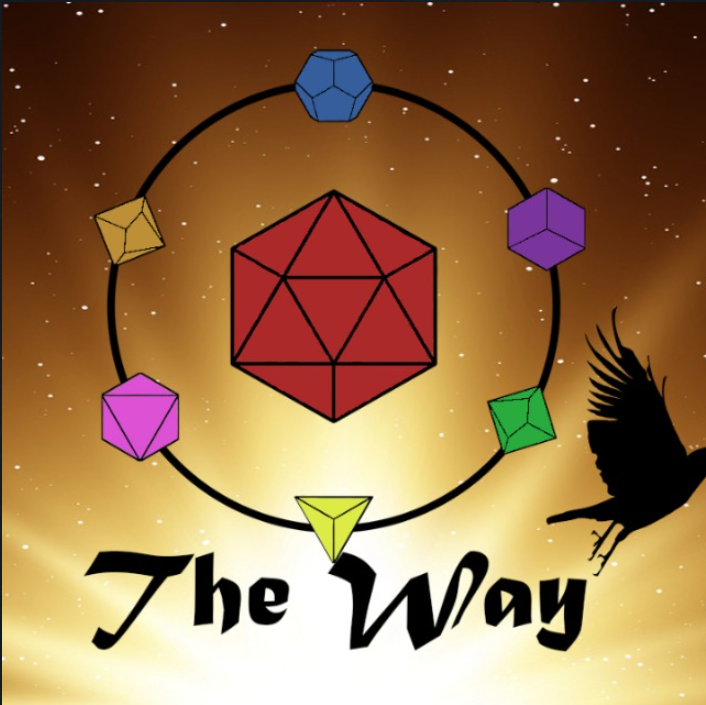

  

# TheWayDND

Session notes and living lore database for our D&D group's campaigns.

## Repository structure

- **`Valkara - Ecos de un nuevo mundo/`** - the active campaign.
  - **`Current/`** - English session-summary notes for the active campaign, one file per session (`dnd_session_<YYYY-MM-DD>_en.md`), each following a Title / Summary / Key Events / Open Questions structure.
    - **`RawNotes/`** - raw transcription `.txt` files the session notes are generated from.
  - **`World DB/`** - the living reference for the active campaign: [characters](Valkara%20-%20Ecos%20de%20un%20nuevo%20mundo/World%20DB/characters.md), [locations](Valkara%20-%20Ecos%20de%20un%20nuevo%20mundo/World%20DB/locations.md), [factions](Valkara%20-%20Ecos%20de%20un%20nuevo%20mundo/World%20DB/factions.md), [timeline](Valkara%20-%20Ecos%20de%20un%20nuevo%20mundo/World%20DB/timeline.md), and [open plot threads](Valkara%20-%20Ecos%20de%20un%20nuevo%20mundo/World%20DB/plot-threads.md). Updated after every new session - see its own [README](Valkara%20-%20Ecos%20de%20un%20nuevo%20mundo/World%20DB/README.md) for the exact update workflow.
  - **`Past/`** - earlier, unrelated campaigns (Session 6, Session 7, ...), kept for archive purposes only. Not tracked in the World DB.
- **`.claude/skills/`** - Claude Code skills that automate this repo's note-taking workflow (see below).
- **`Images/`** - branding assets.

## Claude Code skills

This repo ships two skills for teammates using Claude Code:

- **`dnd-session-notes`** - turns a raw transcript (`.txt`) into a formatted session summary saved in `Current/`.
- **`world-db-update`** - applies a new session note's events to the five World DB files (adding entries, updating existing ones, resolving plot threads).

Typical flow: record the session -> transcribe it to a `.txt` file -> drop it in `Current/RawNotes/` -> run `/dnd-session-notes <path-to-transcript>` -> review -> run `/world-db-update`.

## How to contribute

Want to help keep the session notes or the World DB accurate and up to date? Contributions are welcome, whether or not you use Claude Code.

### If you use Claude Code

1. Clone the repo and open it in Claude Code - the two skills above load automatically.
2. Add your raw transcript under `Valkara - Ecos de un nuevo mundo/Current/RawNotes/`.
3. Run `/dnd-session-notes <path-to-transcript>`, review the result, then run `/world-db-update`.
4. Review the diff and open a PR.

### If you're editing by hand

1. Read the two most recent files in `Current/` first, to match the existing tone and structure (Title / Summary / Key Events / Open Questions) rather than inventing a new one.
2. Follow the update workflow documented in `World DB/README.md` to fold the new session into characters, locations, factions, the timeline, and plot threads.
3. When resolving a plot thread, keep the original question text in place and append the answer after a `**Resolved:**` marker - don't overwrite the question with just the answer.
4. Open a PR - small, focused PRs (one session at a time) are the easiest to review.

### General guidelines

- Keep the World DB in its "living reference" style: terse, present-tense facts, not scene-by-scene narration - that belongs in the session notes, not here.
- Never delete a resolved plot thread - it stays archived in `plot-threads.md`, it's just moved out of *Active*.
- If you're unsure about a name or spelling, check `World DB/characters.md` / `locations.md` first - that's the canonical source, not the raw transcript.
